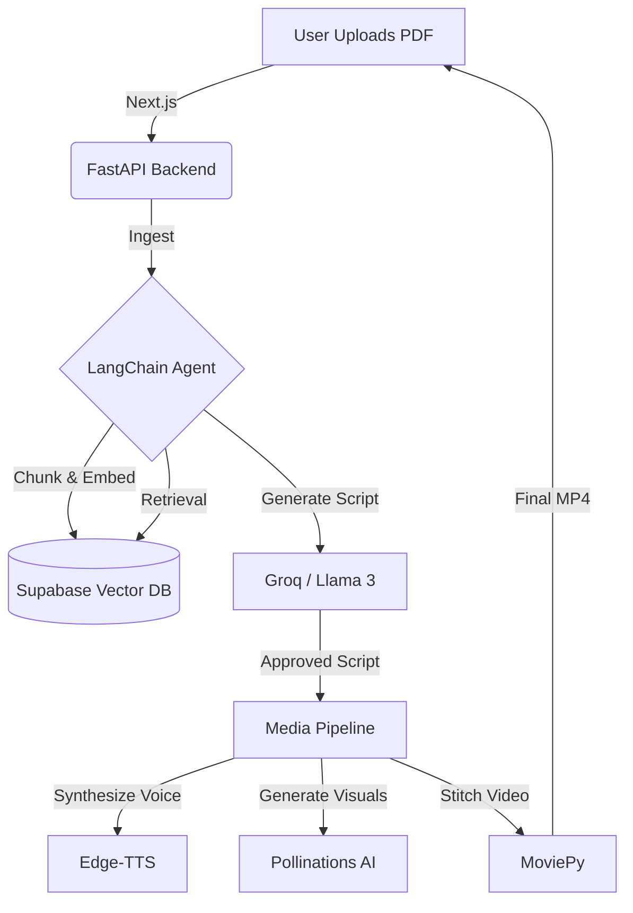

# 🎥 Auto-Didact (AI Video Agent)

[](https://fastapi.tiangolo.com)
[](https://nextjs.org/)
[](https://python.langchain.com/)
[](https://supabase.com/)
[](https://www.python.org/)
[](https://www.typescriptlang.org/)

> **Turn static PDFs into engaging educational videos in seconds.**

## 📖 About The Project

**Auto-Didact** is an autonomous content pipeline that transforms unstructured text documents (PDFs, textbooks, research papers) into short-form multimedia content.

Unlike standard generative video tools that often "hallucinate" facts, this system uses a **Retrieval-Augmented Generation (RAG)** architecture. It ingests user-uploaded documents, extracts verifiable facts, and orchestrates a team of AI agents to produce a script, voiceover, and visual storyboard grounded entirely in the source material.

### 🏗️ Architecture



## ✨ Key Features

- **Source-Based Truth:** Uses RAG so every line of the script is grounded in the uploaded PDF — significantly reduces hallucinations.
- **Ultra-Fast Inference:** Powered by Groq Llama 3 to generate full video scripts quickly.
- **Neural Voice Synthesis:** Human-like narration via Edge-TTS (Microsoft Neural Voices).
- **Semantic Search:** Stores embeddings in Supabase (pgvector) for concept-level retrieval.
- **Programmatic Editing:** MoviePy stitches audio, images, and subtitles into a production-ready `.mp4`.

## 🚀 Getting Started

### Prerequisites

- Python 3.10+
- Node.js 18+
- Supabase account (Free tier available)
- Groq API key (free tier may be available depending on provider)

### Clone the Monorepo

```bash
git clone https://github.com/yourusername/auto-didact.git
cd auto-didact
```

### Setup Backend (FastAPI)

PowerShell (Windows):

```powershell
cd backend
python -m venv venv
venv\Scripts\Activate
python -m pip install -r requirements.txt
```

macOS/Linux (bash):

```bash
cd backend
python -m venv venv
source venv/bin/activate
python -m pip install -r requirements.txt
```

### Setup Frontend (Next.js)

```bash
cd ../frontend
npm install
```

### Environment Variables

Create a `.env` file in `backend/` with the following (example):

```env
GROQ_API_KEY=gsk_...
SUPABASE_URL=https://your-supabase-url.supabase.co
SUPABASE_KEY=ey...
# Add any other keys you need (e.g., OPENAI_API_KEY, EDGE_TTS creds)
```

Be careful not to commit sensitive keys — they should be listed in `.gitignore`.

## 🧭 Usage

Start the backend (development):

```powershell
# from /backend
uvicorn main:app --reload
```

Start the frontend (development):

```bash
# from /frontend
npm run dev
```

Open `http://localhost:3000` in your browser and upload a PDF to try the pipeline.

## 🛣️ Roadmap

- [x] Basic PDF ingestion (RAG pipeline)
- [x] Script generation with Llama 3
- [ ] Automated image generation (Pollinations AI)
- [ ] Frontend video player
- [ ] Export to YouTube/TikTok

## 🤝 Contributing

Contributions welcome! Please open an issue or submit a PR. When contributing, keep these in mind:

- Keep sensitive keys out of commits.
- Update docs for any infra or API changes.
- Share small, focused PRs.

## 📬 Contact

- Your Name — LinkedIn | Twitter

Project Link: https://github.com/yourusername/auto-didact

---

Happy building! If you'd like, I can also:

- Commit this `README.md` for you (create a branch and push).
- Add a minimal `requirements.txt` or `pyproject.toml` if missing.
- Create a CI job to run lint/tests.

Tell me which next step you want me to take.